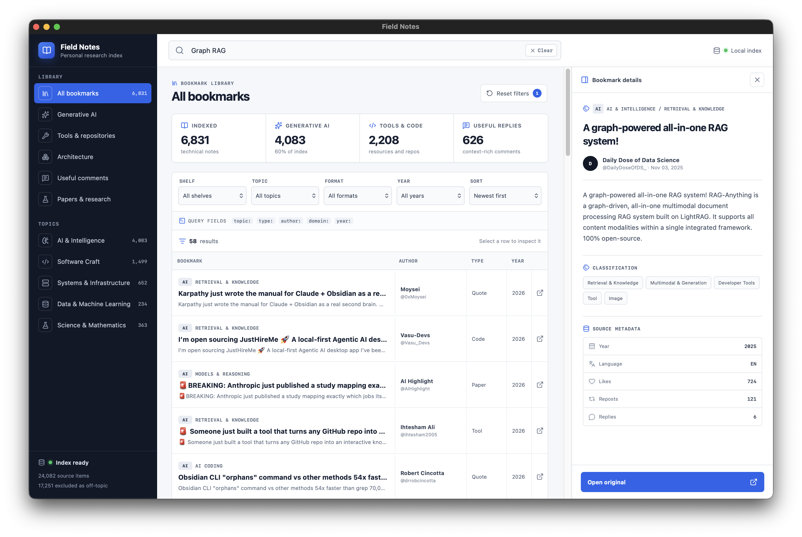

# Field Notes

Field Notes turns a Twitter/X bookmark export into a fast, searchable technical research dashboard and standalone macOS app. Classification happens at build time, with an intentionally compact taxonomy centered on generative AI, software, systems, data, and science.



The repository includes the application code and an audited public edition of the curated technical knowledgebase. Personal exports, local indexes, export metadata, application bundles, and installers remain ignored.

## Explore the public knowledgebase

```bash
cd site
npm ci
npm run dev
```

The checked-in public index loads automatically. It contains public-post excerpts, attribution, original links, classifications, and engagement metadata; it does not contain the raw bookmark export.

## Use your own export

Place a Twillot-compatible export at `posts.jsonl` in the repository root, then run:

```bash
cd site
npm run dev
```

The source export remains read-only. The generated personal index is written to `site/public/data/bookmarks.json`; both paths are ignored by Git. When present, this local index takes precedence over the checked-in public edition.

## Refresh and audit the public edition

Maintainers with a local source export can regenerate the public index with:

```bash
cd site
npm run library:public
```

This applies the technical classifier, public-safety exclusions, contact-detail redaction, and a fail-closed audit before writing `site/public/data/bookmarks.public.json`.

## Build the macOS app

```bash
cd site
npm run desktop:build
```

The standalone application and installer are generated in `site/release/` and are not versioned.

## Dataset caveats

- Classification and safety filtering are automated, heuristic, and necessarily imperfect. A record's presence is not an endorsement or a claim that it is correct. The public edition is limited to English-language records so its text can be audited consistently.
- The public audit blocks known explicit or exploitative sexual material, hateful slurs, dangerous instructions, actionable self-harm content, sensational medical misinformation, doxxing/contact details, credential-like secrets, piracy, and known off-topic politics, conflict, and culture. Novel wording can evade any keyword-based system.
- Posts and engagement counts are snapshots. Originals may be corrected, deleted, made private, or become unavailable; follow the source link for current context.
- Authors retain rights in their posts and linked material. The collection does not archive attached media, and any software license for this repository does not grant rights to third-party content.
- Medicine and biology entries require a recognized research/health source, explicit research methodology, or clear debunking context. Even so, nothing here should be treated as medical, legal, financial, security, or safety advice.
- Some retained technical posts use emphatic or profane language.
- If a record is misclassified, unsafe, incorrectly attributed, or should be removed, please open a repository issue with its post URL or record ID.

Do not commit `posts.jsonl`, export metadata, or `site/public/data/bookmarks.json`. Those local files can reveal private interests and social context even when the referenced posts were public.
